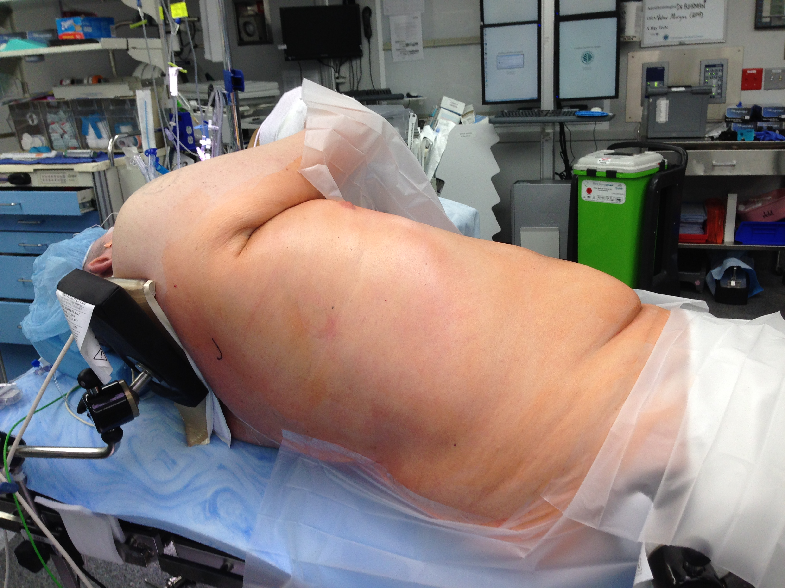

```{r setup, include=FALSE}
library(htmltools)
knitr::opts_chunk$set(echo = TRUE)
```

## Indications

One-stage esophagectomy is the most common approach to esophagectomy.  The pateint is positioned in 'corkscrew' position to allow simultaneous access to the abdomen and chest by prepping both abdomen and chest.


## Room Prep
Confirm positioning equipment (should be available in green ‘bucket’):
• Four black side-rail clamps
• Four rectangular lateral positioners
• Yassargil socket OR large-bore Clark socket (If used, need to confirm that well-leg holder post will fit
into Clark socket )
• Well-leg holder (used as an arm holder)
Stentor open with initial PET scan open (for surgical planning) Review initial endoscopy report with attention
to most cephalad extend of Barrett’s esophagus and invasion of tumor into gastric cardia and lesser curvature
of stomach

## Anesthesia
Confirm that anesthesia has a copy of Dr Buhrman’s protocol Dual-lumen ETT tube (taped to left) 
Arterial
line (left arm will be on arm board) 
Lidocaine drip (see protocol for rate, which depends upon age) Vigileo (?)

## Position
Supine on blue foam pad without draw sheet.
Surgeon marks upper midline with non-sterile skin marker
Foley catheter (with Criticor temperature sensor) Bovie pad Lower-body Bair Hugger at level of thighs
Hair clipped from abdomen, right chest, and right axilla with electric clippers.
If jejunostomy in place, it is usually prepped into the field. If there is an eschar at the jejunostomy site, this
should be removed prior to prep. Jejunostomy is brought inferior and taped to skin (or sutured to skin with
a 0 silk suture with a Keith needle)
Shoulders are shifted to the right in preparation for ‘corkscrew’ positioning
Lateral positioners positioned with pad extending from greater trochanter inferiorly.
Leather strap over thighs with strap inside of bars of lateral positioners
Left arm on armboard
Yassargil socket attached to headpiece of bed on left side. Well-leg holder attached to Yassargil socket and
used to support right forearm (which will cross body)
Right arm crosses body and is supported on well-leg holder.

Lateral positioner placed posterior to spine to support right chest in rolling to the left. This allows access to
the right chest for thoracoscopy. Arm holder is dropped towards the floor enough that right arm is brought
forward.

## Prep
Chloroprep (two sticks) of abdomen, right chest, right axilla. Particular attention to prepping as far as
possible to the left lateral side and the right lateral side. Nipple prepped into field.

## Drape
Perimeter of field draped with 1000 (clear adhesive) drapes. Two blue plastic “U” drapes with center of the
“U” on either lateral side with tails forming the perimeter of the field
Trauma drape. All of right chest and axilla is kept within the field, as is the lateral aspect of the left upper
quadrant. The field does not need to extend inferior to the umbilicus. In general, it is usually possible to
keep all of these area in the field without cutting the drape, except in very large patients.
Ioban over the surgical field after the trauma drape.
Laparoscopic cords (gas, light cord, camera) to tower at left shoulder. Suction irrigator brought off field at
left shoulder. Laparoscopic LigaSure (2 bars) and Bovie (30/30).

## Time Out
ID: Patient name, operation header on consent 
Biology: Benign vs cancer. Likelihood of nodal metastasis.
Tumor location and likelihood of division of esophagus from abdomen (two-phase operation) vs division of
esophagus from chest (four-phage operation). 
Review of chart and PET scan, if necessary. 
Blood: Surgeon’s
expectation of blood loss and availibility of blood (type/screen vs type/cross). If blood has been requested,
are there antiboMedial dies of crossmatch issues? 
Comorbidities: Cardiopulmonary disease. If echo, ejection
fraction and aortic valve area (if abnormal) 
Beta blockage: Note whether patient on home beta blockade and
if so, whether home medication was taken the morning of surgery. Possibility of tension left pneumothorax
due to carbon dioxide entry into left chest during mediastinal dissection Expectation of ventilatory difficulties
due to carbon dioxide entry into the right chest

## Gastric mobilization - Greater Curvature
After infiltration of 1% marcaine, 7cm upper midline incision made for handport. Small incision is made and
pylorus palpated, if possible. Incision is centered over pylorus. GelPort inserted, and abdomen insufflated to
15mmHg. Two 5mm ports placed LUQ. Medial LUQ 5mm port placed in angle between left costal margin
and interior edge of GelPort ring. Lateral LUQ 5mm port placed as far lateral as possible. Depending upon
visualization, a third port may be required between these two and somewhat more inferior.
If feasible, division of gastrocolic omentum starts by delivering transverse colon into GelPort and dividing
ligament with cautery and LigaSure in the avascular plane just cephalad to transverse colon. Dissection
proceeds as far proximal and distal and feasible.
Colon is returned to abdomen and gastricolic ligament divided going distal using LigaSure, taking care to
avoid the colon and the right gastroepiploic artery. Stomach is retracted to the patient’s right with the back
of the left hand, placing the gastrocolic ligament (and short gastric arteries) on stretch. Left gastroepippoic
artery divided with LigaSure near its origin. Short gastric arteries divided with Ligasure close to spleen. As
superior aspect of short gastrics is reached, the dissection plane shifts medially to create a tunnel towards
the base of the left crus. This places the most superior short gastric vessels on stretch and facilitated their
2
division. Once all short gastric vessels divided, peritoneum tethering fundus to diaphragm is incised, and
fundus brushed medially.
If there is bleeding from the splenic hilum this is treated with suction, LigaSure, SurgiFlo, and packing with
a vaginal tape with laparotomy ring.
Dissection plane is brought medially and posterior attachments are divided between stomach and pancreas.
This may require a Megadyne hook.
Kocher Manuver and distal mobilization
Attention is directed to mobilizing the lateral aspect of the duodenum. This can either be accomplished with
the camera through a LUQ port and a 45 degree camera or by placing an additional 5mm port in the RLQ.
Hook cautery is used to incise the connective tissue lateral and posterior to the duodenum. This is extended
as far distal as the gastrocolic venous trunk.
The gastrocolic ligament is now dissected distally, taking care to preserve the integrity of the right gastroepiploic
vessels. An areolar plane generally exists between the fat pad containing the right gastroepiploic vessels and
that containing the transverse mesocolon vessels.
Division of left gastric artery
Lymph nodes around the celiac axis and left gastric artery are now dissected. The extend of dissection
depends upon the tumor location and the presence of nodes her either based upon imaging or palpation.
Dissection begins on the superior edge of the pancreas, and proceeds superiorly to the right crus. The left
gastric (coronary) vein is usually located to the left of the arery and is divided with the LigaSure.
In a two-phase approach, the left gastric artery is now divided with a 30mm gray load (2.0mm) endoGIA
linear stapler. For patients with mid-esophageal tumors, (for whom a four-phase approach is used), if there
is any question about the resectability of the tumor, division of the left gastric gastric artery is generally
deferred until the second abdominal phase.
Mediastinal dissection
The esophagus is now dissected circumferentially at the gastroesophageal junction. The peritoneum overlying
the diaphragm is incised, and circumferential dissection of esopahgus performed. On the left side, it is helpful
to distract the left crus laterally with a Prestige clamp placed on the left crus
The right pleura is widely entered in otder to both facilitate the thoracic dissection of the esophagus and
placing the conduit into the right chest in preparation for the final thoracic phase.
Division of Esophagus (Two-Phase only)
In a four-phase approach, the esophagus is divided from the right chest during the first (of two) thoracic phases.
In a two-phase approach, the esophagus is divided from the abdomen by reaching up into the mediastinum to
divide the esophagus above the tumor. This is only feasible for tumors of the gastroesophageal junction.
In a two-phase approach, the esophagus is divided with a 60mm Medium-Thich (purple) endoGIA TriStaple
stapler.
3
Division of Esophagus (Four-Phase)
Penrose Drain (Four-Phase only)
In a four-phase approach, the esophagus is divided from the chest. In order to facilitate the thoracic dissection,
a 1/4" penrose drain is tied around the distal esophagus and the drain is slid cephalad into the mediastinum.
The ‘tails’ of the drain are directed into the right chest so that they can be grasped from the right chest
during the thoracic phase and can be used to provide traction on the esophagus in order to
Entry into right chest
The pneumoperitoneum in the abdomen is vented and the gas pressure turned down to 8mmHg in preparation
for the thoracic phase.
The bed is rotated to the left 20 degrees.
A site for entry in to the left chest is selected just posterior to the tip of the scapula. An incision is made
here and a 5mm optical port with a 5mm 0 degree scope used to enter the chest. The chest is insufflated at
8mmHg of carbon dioxide, which helps to both copllapase the lung and depress the diaphragm.
Two 12mm ports are placed. The more superior is placed lateral and superior to the nipple. The inferior port
is placed just lateral to the diaphragmatic reflection. It is ciritcal to avoid injury to the diaphragm (and
liver) with the inferior port placement.
A mini-thoracotomy incision is placed along the mid-axillary line, frequently in the same interspace as the
inferior/anterior 12mm port. The chest is entered just superior to the rib and the intercostal muscles divided
with the LigaSure device to allow the ribs to separate. A narrow Deaver retractor is used to guage the space
between the ribs, as the width of the retractor approximates the diameter of the 25mm stapler.
A 5mm ‘U’ port is generally placed as high as possible midway between the scapular tip port and the
anterior/superior 12mm port
t0o the
4
right
5
```{r, out.width = "200px", fig.align='right', echo=FALSE,out.width='.49\\linewidth'}
# Right justified in pdf top/bottom
## knitted to html this is stacked right justified
par(mfrow=c(2,2),las=1)


```


```{r fig.show='hold',out.width='.49\\linewidth', out.width = "200px", echo=FALSE }
## This works side-by-side in pdf
## Not shows in html ?due to fig.show='hold'?
# Full-size in html


```


